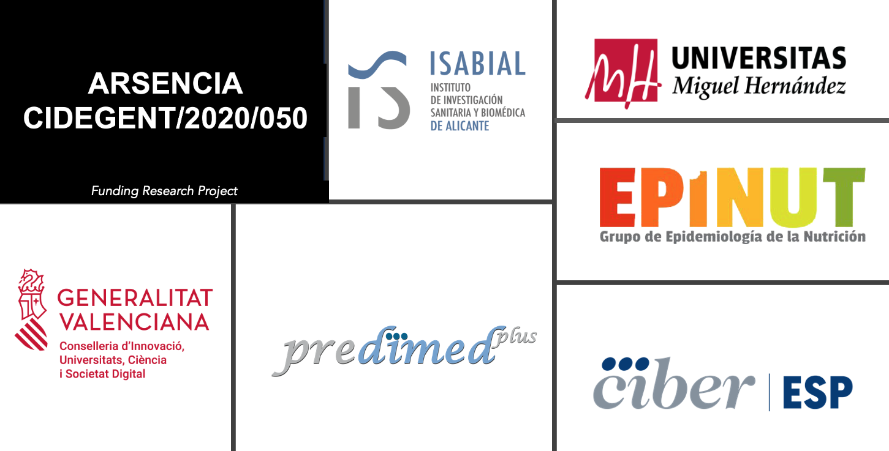

# Jornadas_ARSENCIA_2024

 

 

[English version](https://tonis81.github.io/Jornadas_ARSENCIA_2024_en/)

## **28 y 29 de noviembre de 2024 en el [Aula Magna](https://maps.app.goo.gl/tkF3bYfJ57GDMJ846) en Elche (Universidad Miguel Hernández)**

 

  
  
<a href="mailto:jornadasarsencia@gmail.com">jornadasarsencia@gmail.com</a>

  
<a href="https://docs.google.com/forms/d/e/1FAIpQLScIfY-1FIBzalcdYrARaMbFcnxCOlpydFOttYMIVB-W0YJmUg/viewform">Enlace inscripción</a>

  
<a href="https://docs.google.com/forms/d/e/1FAIpQLSdyGG_DA9wiuElFUp80cyRSuWOf8m4h7CgVNSFPJQTzNLBPqQ/viewform">Registro envío comunicación</a>

  
<a href="https://drive.google.com/drive/folders/1GMEf6Q1cIKK-5A3YU4VQiUWtfoz0FgbQ?usp=drive_link">Descarga plantillas</a>

## **Presentación**

<em>La salud y la alimentación están estrechamente vinculadas. La cantidad y variedad de alimentos que forman parte de nuestra dieta, junto con los modelos de producción de alimentos que actualmente están siendo revisados para promover una mayor sostenibilidad, pueden influir tanto en la ingesta de nutrientes como en la exposición a sustancias nocivas.
</em>

<em>Una alta adherencia a la dieta Mediterránea o a otros patrones saludables basados en alimentos de origen vegetal a lo largo del tiempo contribuye significativamente a promover una buena salud. Sin embargo, los alimentos también pueden contener elementos tóxicos, como el arsénico, cuya exposición crónica, incluso a concentraciones relativamente bajas, puede tener un impacto negativo en la salud. Además, su efecto perjudicial puede ser potenciado por interacciones con otros elementos. Por ello, es de vital importancia desarrollar modelos que permitan evaluar los riesgos para la salud asociados con la exposición a agentes tóxicos especialmente para personas vulnerables como mujeres embarazadas, infantes, niños y personas mayores.
  </em>

<em>Durante estas jornadas, se presentarán evidencias científicas sobre la importancia de la dieta en la salud, así como de la exposición a metales tóxicos a través de los alimentos, y se discutirán estrategias y oportunidades para reducirla. Se destacarán evidencias generadas en proyectos en curso en la Universidad Miguel Hernández (UMH), como ARSENCIA, enmarcado en el programa GenT financiado por la Generalitat Valenciana, el estudio PREDIMED Plus, HidroSOStoneFruit, ThinkinAzul y un reciente proyecto sobre trasmisibilidad de la dieta Mediterránea de madres a hijos financiado por el Instituto de Salud Carlos III. Para lograr este objetivo, se adoptará un doble enfoque científico y educativo para facilitar a estudiantes de grado, máster y doctorado de diversas disciplinas relacionadas interactuar con investigadores y presentar sus trabajos. Además, se dará voz a los participantes en los estudios para que puedan expresar sus percepción, ideas e inquietudes sobre la alimentación, y explorar la posibilidad de integrarlas en futuros proyectos de investigación colaborativos.
</em>

<em>Con este propósito en mente, se han planificado diversas actividades, que incluyen la recopilación de información sobre la dieta de los asistentes mediante cuestionarios, con el objetivo de evaluar su adherencia a prácticas alimenticias saludables, así como ponencias de investigadores de prestigio y talleres demostrativos. A partir de toda la información recabada durante el evento, se espera desarrollar una guía o informe de buenas prácticas que contribuya a promover el consumo de alimentos que favorezcan una dieta equilibrada y beneficiosa para la salud.
</em>

## **Agenda**

### Programa Día 1 - 28 de Noviembre 2024

> #### 9:00 Recepción de asistentes

> #### 9:30 Inauguración de las jornadas
>
> Ponente: Prof. Ángel Carbonell Barrachina
>
> Descripción: El Prof. Ángel Carbonell Barrachina, Vicerrector de Investigación y Transferencia de la UMH, dará inicio oficialmente a las jornadas.

> #### 9:45 Epidemiología de la Nutrición
>
> Ponente: Prof. Jesús Vioque López
>
> Descripción: El Prof. Jesús Vioque López es el director del grupo de investigación Epidemiología de la Nutrición (EPINUT), donde se gestaron estas jornadas. El Prof. Vioque introducirá el papel de la dieta en la salud.

> #### 10:15 Contaminación y Salud
>
> Ponente: Dr. Antonio J. Signes Pastor
>
> Descripción: El Dr. Antonio J. Signes Pastor es Investigador Senior financiado por el programa GenT de la Generalitat Valenciana. El Dr. Signes Pastor presentará el papel de la epidemiología de los elementos traza, incluyendo su perspectiva de seguridad y calidad alimentaria.

> #### 10:45 **Pausa café**

> #### 11:15 El rol de l@s estadístic@s en contextos clínicos
>
> Ponente: Dr. Pablo Martínez Camblor
>
> Descripción: Breve revisión histórica personal de mis más de 25 años en bioestadística. Analizaré los cambios y la evolución de los métodos y la percepción de la estadística, así como temas fundamentales en la ciencia actual como la reproducibilidad, los contextos causales y conceptos similares.

> #### 11:45 Asociación entre exposición a mezcla de metales y neurodesarrollo en niños INMA
>
> Ponente: Dra. Susana Díaz Coto
>
> Descripción: La Dra. Susana Díaz Coto presentará el trabajo que lidera sobre la exposición a mezclas de metales y el desarrollo neurológico en niños de 4 a 5 años, en el estudio de cohorte INfancia y Medio Ambiente (INMA).

> #### 12:15 Exposición a factores ambientales en el estudio de cohorte de nacimiento NHBCS
>
> Ponente: Dra. Leyre Notario Barandiarán
>
> Descripción: La Dra. Leyre Notario Barandiarán presentará la cohorte de nacimiento, New Hampshire Birth Cohort Study (NHBCS), y detallará su investigación sobre la exposición a metales a través de la dieta.

> #### 12:45 Metales en madres y en niños de la cohorte NELA
>
> Ponente: Dra. Eva Morales Bartolomé
>
> Descripción: La Dra. Eva Morales Bartolomé presentará la cohorte de nacimiento Nutrition in Early Life and Asthma (NELA) y expondrá su investigación sobre la exposición a metales durante el embarazo y la infancia.

> #### 13:15 **Pausa activa**

> #### 13:30 **Comida Tapas y Gurus**

> #### 15:00 Sesión pósteres estudiantes

> #### 17:30 Entrega de premios y fin de las jornadas del día 1

-----

### Programa Día 2 - 29 de Noviembre 2024

> #### 9:00 Recepción de asistentes

> #### 9:30 Proyecto Agroalnext - Riego Deficitario Regulado
>
> Ponente: Dra. Lucía Andreu Coll
>
> Descripción: La Dra. Lucía Andreu Coll presentará el proyecto Agroalnext y expondrá los resultados de su investigación sobre el impacto del riego deficitario regulado en la actividad antioxidante, el perfil de ácidos grasos, los compuestos volátiles y la calidad del fruto de la variedad de albaricoque 'Mirlo Rojo'.

> #### 9:45 Acuicultura, calidad e innovación - Proyecto Thinkin Azul
>
> Ponente: Dra. Marina Cano Lamadrid
>
> Descripción: Uno de los objetivos del proyecto es la caracterización de los piensos formulados para dorada de acuicultura con proteínas alternativas junto con la evaluación del efecto de la alimentación de dichos piensos a lo largo del ciclo completo de vida en el contenido de contaminantes abióticos en las partes comestibles y vísceras.

> #### 10:00 Transmisión de la Dieta Mediterránea en la infancia en INMA
> Ponente: Dra. Sandra González Palacios
>
> Descripción: La Dra. Sandra González Palacios presentará la cohorte INMA y sus hallazgos sobre la transmisión de la dieta mediterránea de madres a hijos, su relación con contaminantes ambientales y el riesgo cardiometabólico.

> #### 10:15 **Pausa activa**

> #### 10:30 **Pausa café**

> #### 11:00 Experiencia participantes del proyecto Predimed-Plus
>
> Ponente: xxxxx
>
> Descripción: Predimed-Plus evalúa el efecto de una intervención intensiva con objetivos de pérdida de peso, basada en el consumo de dieta mediterránea hipocalórica, promoción de actividad física y terapia conductual en la prevención de enfermedades cardiovasculares.

> #### 11:30 Análisis sensorial **Cata**
>
> Ponente: Dr. Luís Noguera Artiaga
>
> Descripción: El Dr. Luís Noguera Artiaga, impartirá una introducción al análisis sensorial y nos guiará en una cata.

> #### 13:00 Clausura
>
> Dr. Antonio J. Signes Pastor

> #### 13:30 Fin de las Jornadas ARSENCIA

## **Ponentes**

> ### **Nacionales**

>

>
>
Marina Cano Lamadrid - <a href="mailto:marina.canol@umh.es">marina.canol@umh.es</a>. Investigadora postdoctoral en la UMH, miembro del Grupo de Calidad y Seguridad Alimentaria del Departamento de Tecnología Agroalimentaria e investigadora en CIAGRO-UMH. Experta en Análisis Sensorial de Alimentos y en Inocuidad Alimentaria. Colaboradora en el proyecto ThinkinAzul.

>

>

>
>
Eva Morales Bartolomé - <a href="mailto:evamorales@um.es">evamorales@um.es</a>. Profesora contratada doctora de Medicina Preventiva y Salud Pública en la Universidad de Murcia y miembro del grupo de Investigación en Pediatría del IMIB-Arrixaca. Codirectora de la cohorte NELA, que investiga el impacto del ambiente temprano en la salud respiratoria infantil, con interés en los orígenes del asma y las alergias. Miembro del comité ejecutivo de GAN y de CIBERESP. Sus investigaciones se centran en estudios de cohortes al nacimiento, epidemiología del asma, y epidemiología ambiental y molecular.

>

>

>
>
Luis Noguera Artiaga - <a href="mailto:lnoguera@umh.es">lnoguera@umh.es</a>. Profesor Ayudante Doctor en la UMH. Miembro del grupo de investigación de Calidad y Seguridad Alimentaria, del Instituto de Investigación e Innovación Agroalimentario y Agroambiental de la UMH. Sus investigaciones se fundamentan en el estudio del análisis sensorial en los alimentos y en la incidencia que las prácticas agrícolas tienen sobre la calidad de estos. Además, estudia la incidencia que el aroma tiene sobre el sabor y la calidad de los alimentos mediante el análisis de sus compuestos orgánicos volátiles. Es director del Panel de Cata de la Denominación de Origen Protegida Vinos de Alicante y director del Panel de Cata de la Denominación de Origen Protegida Pimentón de Murcia.

>

>

>
>
Lucía Andreu Coll - <a href="mailto:l.andreu@umh.es">l.andreu@umh.es</a>. Doctora en Recursos y Tecnologías Agrarias, Agroambientales y Alimentarias por la Universidad Miguel Hernández. Miembro del grupo de investigación en Fruticultura y Técnicas de Producción en CIAGRO-UMH. Su investigación se centra en la producción y calidad de cultivos ambientalmente sostenibles. Actualmente colabora en el proyecto AGROALNEXT/2022/040, evaluando técnicas de riego deficitario en frutales de hueso.

>

> ### **Internacionales**

>

>
>
Pablo Martinez Camblor - <a href="mailto:Pablo.Martinez-Camblor@hitchcock.org">Pablo.Martinez-Camblor@hitchcock.org</a>. "Research Biostatistician" en Dartmouth Health (New Hampshire, USA), doctor en estadística-matemática por la Universidad de Oviedo (Asturias). Con más de 25 años de experiencia en Salud Pública e investigación clínica, ha trabajado en instituciones como CIMERA, el Departamento de Salud Pública de Guipúzcoa y el HUCA. Ha impartido cursos en varias universidades, incluyendo Dartmouth College, donde actualmente participa en el programa de Máster en Ciencias Biomédicas Cuantitativas de la Geisel School of Medicine.

>

>

>
>
Susana Díaz Coto - <a href="mailto:Susana.Diaz.Coto@hitchcock.org">Susana.Diaz.Coto@hitchcock.org </a>. Doctora en Matemáticas y Estadística por la Universidad de Oviedo y Científica Senior en Dartmouth Health, donde actualmente proporciona soporte metodológico en Estadística al Departamento de Ortopedia. Anteriormente, trabajó en el Departamento de Epidemiología de Dartmouth College, colaborando en los estudios NHBCS y ECHO. También colabora en el estudio INMA. Su línea de investigación se centra en la estimación no paramétrica de métodos de evaluación de la capacidad discriminatoria de biomarcadores en problemas de clasificación binaria.

>

>

>
>
Leyre Notario Barandiaran - <a href="mailto:Leyre.Notario.Barandiaran@dartmouth.edu">Leyre.Notario.Barandiaran@dartmouth.edu</a>. Investigadora postdoctoral en el grupo de Epidemiologia en Dartmouth College (Geisel School of Medicine). Líneas de investigación principales: Epidemiología de la Nutrición y Epidemiología Ambiental en relación a diversos outcomes como el neurodesarrollo y salud cardiovascular. Investigadora colaboradora en estudios de relevancia internacional como PREDIMED-Plus, y los estudios de cohorte de Nacimiento INMA, NELA y NHBCS. También participa como investigadora colaboradora en diversos proyectos en el programa ECHO del NIH.

>

> ## **Comité organizador**:

> ### Presidente

>

>
>
Antonio José Signes Pastor - <a href="mailto:asignes@umh.es">asignes@umh.es</a>. Investigador senior CIDEGENT en la Universidad Miguel Hernández (UMH) y el Instituto de Investigación Sanitaria y Biomédica de Alicante (ISABIAL). Miembro del CIBER de Epidemiología y Salud Pública (CIBERESP). Experto en contaminantes y elementos traza. Investigador principal del proyecto ARSENCIA, coinvestigador principal del proyecto HidroSOStoneFruit y colaborador en los proyectos PREDIMED, PI23/01568 y ThinkinAzul.

>

> ### Miembros del comité

>

>
>
Jesús Vioque López - <a href="mailto:vioque@umh.es">vioque@umh.es</a>. Catedrático de Medicina Preventiva y Salud Pública en la UMH. Obtuvo una maestría en salud pública y formación en epidemiología nutricional en Harvard. Dirige el grupo de Epidemiología de la Nutrición (EPINUT), que investiga el papel de la dieta en enfermedades no transmisibles. Ha liderado estudios como PANESOES, sobre dieta y riesgo de cáncer, y el Estudio INMA, sobre contaminantes y desarrollo infantil. Su grupo participa en PREDIMED-PLUS, que evalúa una dieta mediterránea hipocalórica en el riesgo cardiovascular y diabetes.

>

>
>
Manuela Garcia De La Hera - <a href="mailto:manoli@umh.es">manoli@umh.es</a>. Catedrática de Medicina Preventiva y Salud Pública en la UMH. Miembro del grupo EPINUT, enfocado en investigar el papel de la dieta en el riesgo de enfermedades no transmisibles. Ha realizado estudios sobre supervivencia, estilos de vida y dieta, así como sobre Epidemiología de la Nutrición y Terapia Ocupacional en Trastornos del Neurodesarrollo. Colaboradora en los estudios INMA y PREDIMED-PLUS, y coautora de la app móvil Anticipa-TEA, dirigida a niños con Trastorno del Espectro Autista.

>

>

>
>
Laura Torres Collado - <a href="mailto:l.torres@umh.es">l.torres@umh.es</a>. Profesora ayudante doctor en Salud Pública en la UMH e investigadora postdoctoral en el grupo EPINUT de la UMH. Adscrita a ISABIAL y CIBERESP, sus investigaciones se centran en estilos de vida, dieta y supervivencia en adultos, y en la epidemiología de la Nutrición y Terapia Ocupacional en Trastornos del Neurodesarrollo. Colabora en el estudio PREDIMED-Plus y es coautora de la app Anticipa-TEA para niños con Trastorno del Espectro Autista.

>

>

>
>
Alejandro Oncina Canovas - <a href="mailto:aoncina@umh.es">aoncina@umh.es</a>. Investigador postdoctoral del grupo EPINUT de la UMH. Adscrito a ISABIAL y a CIBERESP. Su principal línea de investigación se centra en examinar la asociación entre la adherencia a patrones dietéticos pro-vegetarianos (patrones de dieta que simulan a las dietas vegetarianas) y diferentes resultados en salud. Además, es investigador colaborador en ARSENCIA y en otros estudios de relevancia internacional como PREDIMED-Plus y el estudio de cohortes INMA. 

>

>

>
>
Laura Maria Compañ Gabucio - <a href="mailto:lcompan@umh.es">lcompan@umh.es</a>. Investigadora postdoctoral del grupo EPINUT de la UMH. Adscrita a ISABIAL y a CIBERESP. Líneas de investigación principales: Epidemiología de la Nutrición y Terapia Ocupacional en Trastornos del Neurodesarrollo. Investigadora colaboradora en estudios de relevancia internacional como PREDIMED-Plus y Proyecto INMA. Coautora de la aplicación para móviles Anticipa-TEA, dirigida a colectivo infantil con Trastorno del Espectro Autista y sus familiares.

>

>

>
>
Carolina Ojeda Belokon - <a href="mailto:cojeda@umh.es">cojeda@umh.es</a>. Graduada en Nutrición Humana y Dietética por la Universidad de Alicante (UA) y Máster de Salud Pública, conjunto UMH y UA. Actualmente, cuenta con contrato predoctoral de la UMH en el grupo de EPINUT de la UMH participando en diferentes proyectos como PREDIMED-Plus y realiza su tesis doctoral en el Programa de Doctorado en Salud Pública, Ciencias Médicas y Quirúrgicas de la UMH.

>

>

>
>
Diana Mancheño Bañon - <a href="mailto:dmancheno@umh.es">dmancheno@umh.es</a>.Graduada en Terapia Ocupacional por la UMH y Máster de Salud Pública, conjunto UMH y UA. Actualmente, cuenta con contrato del Programa INVESTIGO de ISABIAL como investigadora colaboradora en el grupo de EPINUT de la UMH participando en diferentes proyectos como PREDIMED-Plus y realiza su tesis doctoral en el Programa de Doctorado en Salud Pública, Ciencias Médicas y Quirúrgicas de la UMH.

>

>
>
Maria Del Carmen Esquiva Antolino - <a href="mailto:mesquiva@umh.es">mesquiva@umh.es</a>. Graduada en Veterinaria por la Universidad de Murcia (UMU) y Máster de Salud Pública, conjunto UMH y UA. Actualmente, cuenta con contrato del Programa INVESTIGO de ISABIAL como investigadora colaboradora en el grupo de Epidemiología de la Nutrición (EPINUT) de la UMH participando en diferentes proyectos como PREDIMED-Plus y realiza su tesis doctoral en el Programa de Doctorado en Salud Pública, Ciencias Médicas y Quirúrgicas de la UMH. 

>

>

>
>
Sandra Gonzalez Palacios - <a href="mailto:sandra.gonzalezp@umh.es">sandra.gonzalezp@umh.es</a>. Investigadora postdoctoral de CIBERESP. Miembro del grupo EPINUT y de ISABIAL. Dietista-Nutricionista, Doctora en Salud Pública y especialista en Epidemiología de la Nutrición. Investigadora principal del proyecto FIS PI23/01568 y del Proyecto Intramural CIBERESP ESP24PI02. Colaboradora en otros estudios como el PREDIMED Plus y el estudio INfancia y Medio Ambiente.

>

> ## **Comité evaluador**:

>

>
Francisca Hernández García - <a href="mailto:francisca.hernandez@umh.es">francisca.hernandez@umh.es</a>. Catedrática en la UMH, miembro del Grupo de Investigación en Fruticultura y Técnicas de Producción, Investigadora Titular en CIAGRO-UMH y miembro de la Comisión Académica del Programa de Doctorado en Recursos y Tecnologías Agrarias, Agroambientales y Alimentarias. Experta en Fruticultura y Técnicas de Producción. Investigadora principal del proyecto HidroSOStoneFruit y colaboradora en el proyecto ThinkinAzul.

>

>
Miguel García-Villarino - <a href="mailto:garciavmiguel@uniovi.es">garciavmiguel@uniovi.es</a>. Profesor Ayudante Doctor en el Área de Medicina Preventiva y Salud Pública de la Universidad de Oviedo. Adscrito al Instituto de Investigación Sanitaria del Principado de Asturias y al Instituto Universitario de Oncología del Principado de Asturias. Entre sus líneas prioritarias se encuentran el uso de los datos para la mejora en la atención a las personas con diabetes y el estudio epidemiológico de la exposición a contaminantes ambientales y su impacto en la salud humana, con enfoque en la diabetes mellitus tipo 2 en el Principado de Asturias.

>

>
Rocío Fernández Iglesias - <a href="mailto:fernandezirocio@uniovi.es">fernandezirocio@uniovi.es</a>. Profesora en Estadística e Investigación Operativa y Didáctica de las Matemáticas en la Universidad de Oviedo, y Doctora en Biomedicina y Oncología Molecular por la misma universidad. Su principal línea de investigación se centra en la aplicación de métodos estadísticos en el campo de la epidemiología y la salud pública. Adscrita al Instituto de Investigaciones Sanitarias del Principado de Asturias y al Instituto Universitario de Oncología del Principado de Asturias.

>

>
Sonia Pérez Fernández - <a href="mailto:soniapfdez@gmail.com">soniapfdez@gmail.com</a>. Doctora en Matemáticas y Estadística por la Universidad de Oviedo y la Universidad Técnica de Viena. Actualmente trabaja como Profesora Ayudante Doctora del área de Estadística e Investigación Operativa de la Universidad de Oviedo, colaborando en proyectos de avances en la comparación, la clasificación y el análisis de datos de entornos socioeconómicos y biosanitarios. Su línea de investigación se centra en la generalización de la curva ROC para explorar conjuntos de clasificación binaria que optimicen la capacidad discriminatoria de biomarcadores univariantes y multivariantes.

> ## **Comité científico**:

> ### Presidente

> Antonio J. Signes Pastor, Universidad Miguel Hernández (España)

> ### Miembros del comité

> Jesús Vioque López, Universidad Miguel Hernández (España)

> Manuela García de la Hera, Universidad Miguel Hernández (España)

> Laura Torres Collado, Universidad Miguel Hernández (España)

> Sandra González Palacios, Universidad Miguel Hernández (España)

> Alejandro Oncina Cánovas, Universidad Miguel Hernández (España)

> Laura M. Compañ Gabucio, Universidad Miguel Hernández (España)

> Carolina Ojeda Belokon, Universidad Miguel Hernández (España)

> Diana Mancheño Bañón, Universidad Miguel Hernández (España)

> María del Carmen Esquiva Antonlino, Universidad Miguel Hernández (España) 

> Leyre Notario Barandiaran, Dartmouth College (Estados Unidos)

>

>
Jacek Lyczko (Polonia)- <a href="mailto:jacek.lyczko@upwr.edu.pl">jacek.lyczko@upwr.edu.pl</a>. Dr. Jacek Lyczko, se graduó en 2017 de la Facultad de Biotecnología y Ciencias de los Alimentos de la Universidad de Ciencias de la Vida en Wroclaw. Obtuvo su doctorado en 2021 y su habilitación en 2024. Actualmente trabaja en el Departamento de Química de Alimentos y Biocatálisis en la UPWr. Su investigación se centra en la analítica química y la cromatografía, con énfasis en la calidad de los alimentos. Se especializa en aceites esenciales y perfiles aromáticos de hierbas, especias y plantas farmacopeas, y estudia el impacto del secado en la calidad de las plantas. Ha gestionado proyectos como "Calidad Sensorial del Olor de las Hierbas" y actualmente supervisa "Nuevos Agentes Activos del Apetito".

>

>
Alexandros Stratakos (Reino Unido)- <a href="mailto: alexandros.stratakos@uwe.ac.uk">alexandros.stratakos@uwe.ac.uk</a>. Dr. Alexandros Stratakos - Profesor Asociado en la University of the West of England, Bristol, Reino Unido. Alexandros obtuvo su doctorado en 2015 de la Queen’s University Belfast, Reino Unido. Actualmente lidera un grupo de investigación multidisciplinario enfocado en desarrollar tecnologías novedosas para mejorar la seguridad, calidad y sostenibilidad de la cadena de suministro de alimentos. Su equipo tiene como objetivo traducir los hallazgos experimentales en aplicaciones prácticas que beneficien a las partes interesadas de la industria, las autoridades públicas y los consumidores. Enseña asignaturas como Producción Alimentaria Sostenible, Agentes Antimicrobianos, y Ciencia y Emprendimiento.

>

>
Dr. Reyhan Selin Uysal Uysal Afacan  (Tuquía)- <a href="mailto:selin.uysal@bilgi.edu.tr">selin.uysal@bilgi.edu.tr</a>. Profesora Asistente en la Universidad Bilgi de Estambul, Departamento de Genética e Ingeniería Bioquímica. Fue investigadora postdoctoral con el grupo de investigación en Calidad y Seguridad Alimentaria del CIAGRO de la UMH. Su investigación se centra en el análisis de alimentos mediante métodos espectroscópicos, sensores ópticos y quimiometría, así como en el estudio de compuestos volátiles/orgánicos, fenólicos, antocianinas, análisis sensorial de productos agrícolas y fermentados, y el impacto de las prácticas agrícolas y de procesamiento en sus compuestos bioactivos, perfil sensorial y calidad.

> ## **Enlaces de interés:**

> [EPINUT](https://epinut.umh.es/en/epinut/)
> [CIAGRO-UMH](https://ciagro.umh.es/)
> [ThinkinAzul](https://thinkinazul.es/)
> [Predimed-Plus](https://www.predimedplus.com/en/)
> [Agroalnext](https://agroalnextgva.umh.es/agroalnext-gva/)
> [Plan GenT GVA](https://ceice.gva.es/es/web/ciencia/convocatories_2024/d-programa-per-al-suport-a-persones-investigadores-amb-talent-pla-gent)
> [Máster Salud Pública - UMH](https://msp.umh.es/)
> [NHBCS](https://geiselmed.dartmouth.edu/childrenshealth/new-hampshire-birth-cohort-study/)
> [INMA](https://www.proyectoinma.org/en/)
> [NELA](https://nela.imib.es/)
> [ARSENCIA](https://tonis81.github.io/ARSENCIA-Project/)

 

