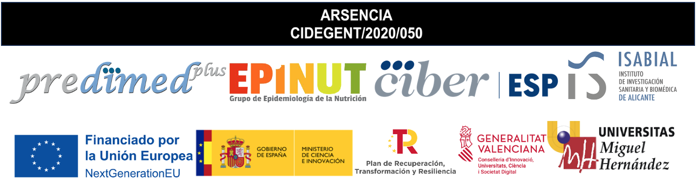

# Jornadas_ARSENCIA_2024

 

# **Dieta y Exposición a Metales: Implicaciones para la Salud Global**

 

## **28 y 29 de noviembre de 2024 en el [Aula Magna](https://maps.app.goo.gl/tkF3bYfJ57GDMJ846) en Elche (Universidad Miguel Hernández)**

 

## **AGENDA**

> ## **Ponentes invitados**
>
> ### **Nacionales**
>
> xxxx
>
> ### **Internacionales**
>
> Pablo Martinez Camblor - [Pablo.Martinez-Camblor@hitchcock.org](mailto:Pablo.Martinez-Camblor@hitchcock.org)
>
> Susana Díaz Coto - [susana.diaz.coto@dartmouth.edu](mailto:susana.diaz.coto@dartmouth.edu)
>

>

>
>
Leyre Notario Barandiaran - <a href="mailto:Leyre.Notario.Barandiaran@dartmouth.edu">Leyre.Notario.Barandiaran@dartmouth.edu</a>. Investigadora post-doctoral. Farmacia y Epidemiología

>

> ## **Comité organizador**:
>

>

>
>
Laura Torres Collado - <a href="mailto:l.torres@umh.es">l.torres@umh.es</a>. XXXXXXXX

>

>

>
>
Alejandro Oncina Canovas - <a href="mailto:aoncina@umh.es">aoncina@umh.es</a>. XXXXXXXX

>

>

>
>
Antonio José Signes Pastor - <a href="mailto:asignes@umh.es">asignes@umh.es</a>. Investigador senior CIDEGENT en la Universidad Miguel Hernández (UMH) y el Instituto de Investigación Sanitaria y Biomédica de Alicante (ISABIAL). Miembro del CIBER de Epidemiología y Salud Pública (CIBERESP). Experto en contaminantes y elementos traza. Investigador principal del proyecto ARSENCIA, coinvestigador principal del proyecto HidroSOStoneFruit y colaborador en los proyectos PREDIMED, PI23/01568 y ThinkinAzul.

>

>

>
>
Carolina Ojeda Belokon - <a href="mailto:cojeda@umh.es">cojeda@umh.es</a>. Investigadora predoctoral en la Universidad Miguel Hernández (UMH) y el Instituto de Investigación Sanitaria y Biomédica de Alicante (ISABIAL). Me gradué en nutrición Humana y Dietética en 2017 y realicé el Máster en Salud Pública en 2018. Actualmente, me encuentro realizando mi tesis doctoral en un proyecto de supervivencia y dieta en población adulta española. 

>

>

>
>
Laura Maria Compañ Gabucio - <a href="mailto:lcompan@umh.es">lcompan@umh.es</a>. XXXXXXXX

>

>

>
>
Manuela Garcia De La Hera - <a href="mailto:manoli@umh.es">manoli@umh.es</a>. XXXXXXXX

>

>

>
>
Diana Mancheño Bañon - <a href="mailto:dmancheno@umh.es">dmancheno@umh.es</a>. XXXXXXXX

>

>

>
>
Jesús Vioque López - <a href="mailto:vioque@umh.es">vioque@umh.es</a>. Catedrático de Medicina Preventiva y Salud Pública en la UMH. Obtuvo una maestría en salud pública y formación en epidemiología nutricional en Harvard. Dirige el grupo EPINUT, que investiga el papel de la dieta en enfermedades no transmisibles. Ha liderado estudios como PANESOES, sobre dieta y riesgo de cáncer, y el Estudio INMA, sobre contaminantes y desarrollo infantil. Su grupo participa en PREDIMED-PLUS, que evalúa una dieta mediterránea hipocalórica en el riesgo cardiovascular y diabetes.

>

>

>
>
Maria Del Carmen Esquiva Antolino - <a href="mailto:mesquiva@umh.es">mesquiva@umh.es</a>. XXXXXXXX

>

>

>
>
Sandra Gonzalez Palacios - <a href="mailto:sandra.gonzalezp@umh.es">sandra.gonzalezp@umh.es</a>. XXXXXXXX

>

> ## **Comité científico**:
>
> Pablo Martinez Camblor - [Pablo.Martinez-Camblor@hitchcock.org](mailto:Pablo.Martinez-Camblor@hitchcock.org)
>
> Susana Díaz Coto - [susana.diaz.coto@dartmouth.edu](mailto:susana.diaz.coto@dartmouth.edu)
>
> Leyre Notario Barandiaran - [Leyre.Notario.Barandiaran@dartmouth.edu](mailto:Leyre.Notario.Barandiaran@dartmouth.edu)

> ## **Comité evaluador**:
>
> - xxx[xx@xx](mailto:xx@xx)

> ## **Enlaces de interés:**
>
> [EPINUT](https:XXXXXXX)

 

